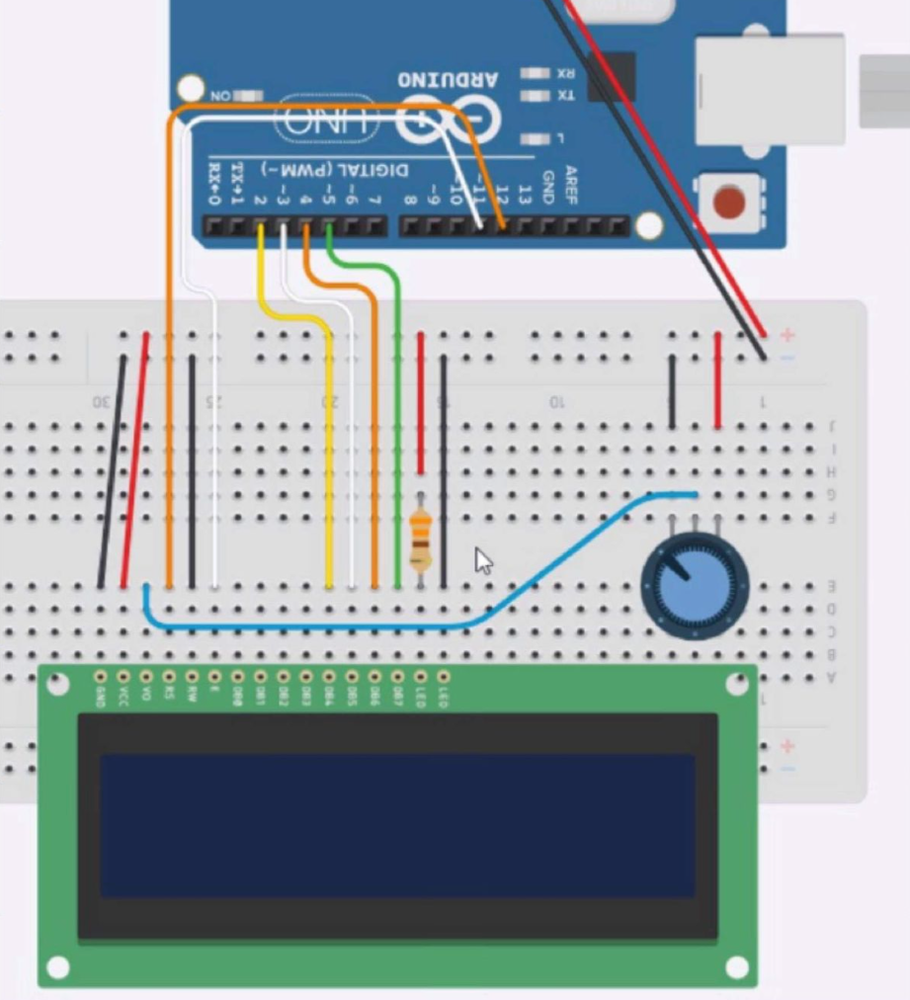

# Arduino Game (Chrome Dinosaur Jump Rendition)

A recreation of the Google Chrome dinosaur jump game using an Arduino Uno, buttons, buzzers, potentiometer and an LCD module. The code was written in C++ and makes uses of array manipulations
to create the scrolling effect of the character. For those unfamiliar with the game, the objective is to jump over all the obstacles (in this rendition, the obstacles are trees to jump over).

This game features sound effects for each jump and a game over chyme (lightly inspired by Mario Bros). Check out the game demo gif below!

  

To create this project, simply follow this schematic shown below and upload the game Full_Game.ino file onto the Arduino Uno board.

